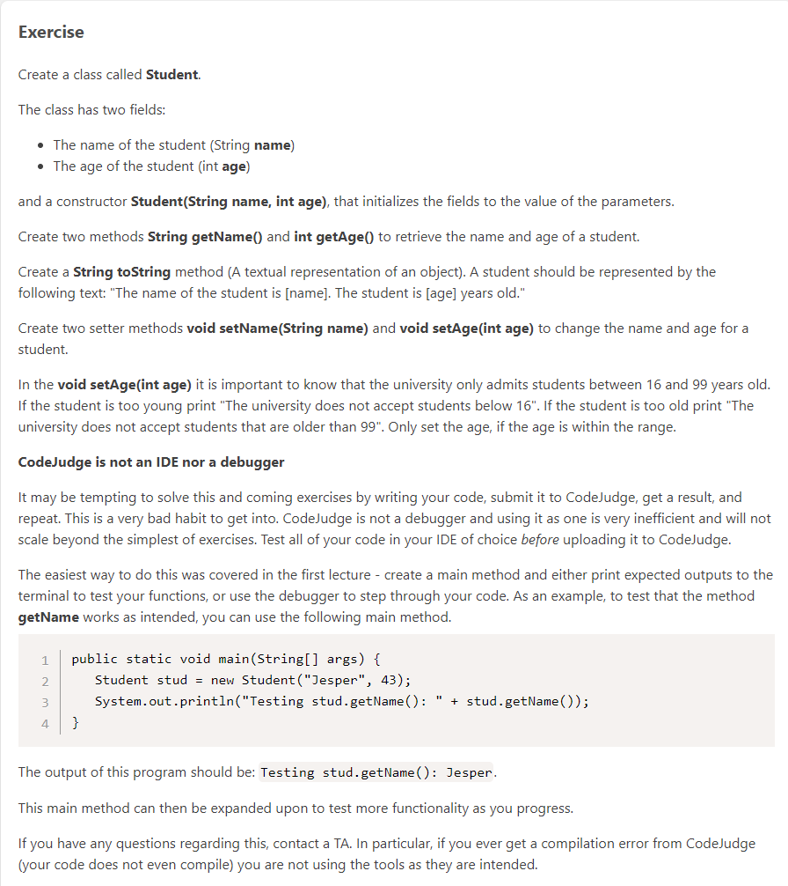
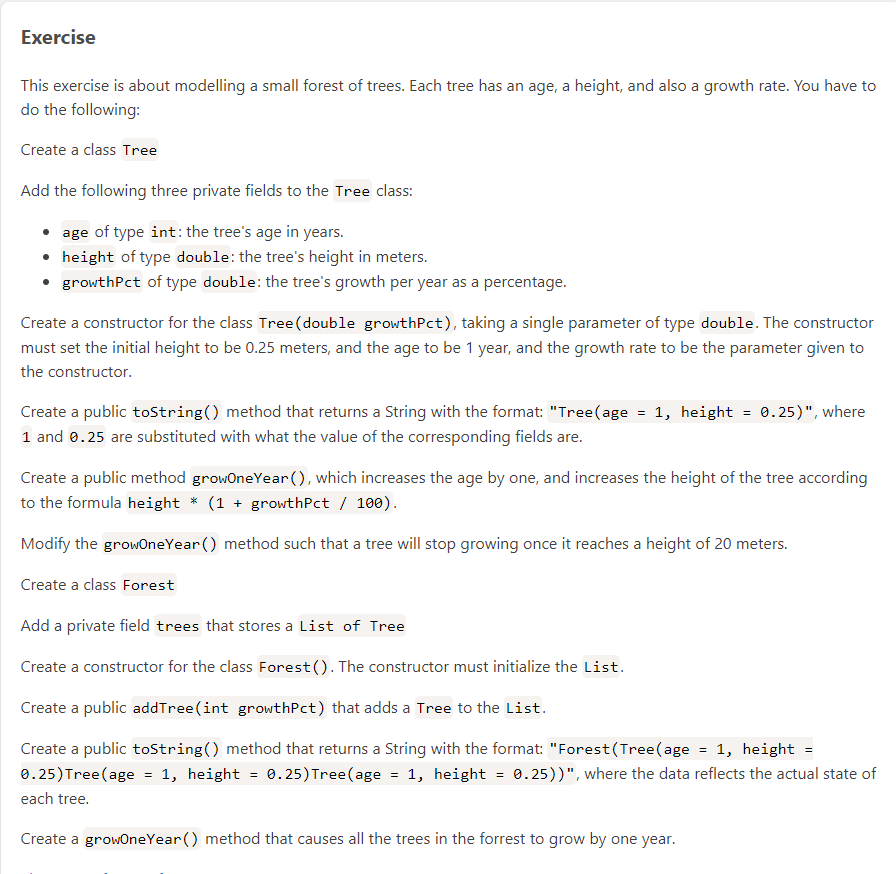
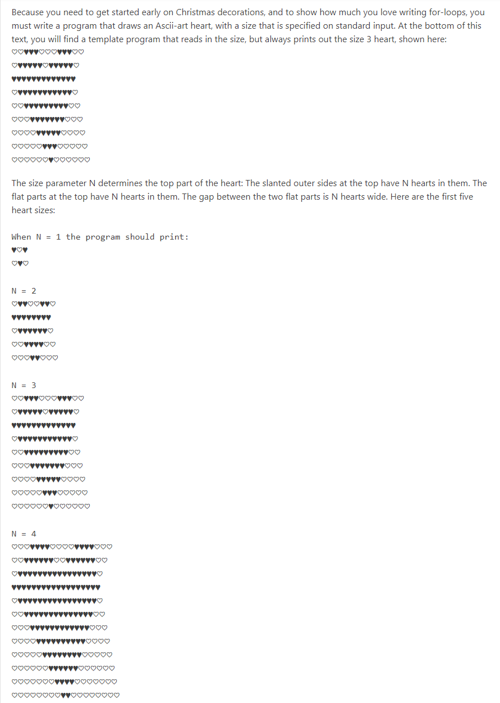
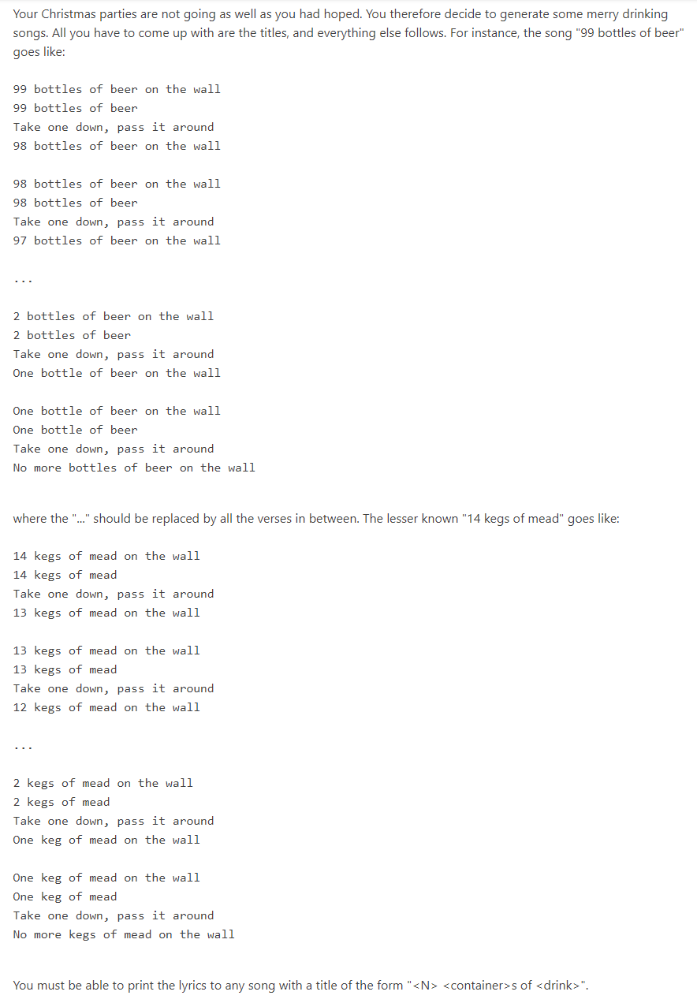
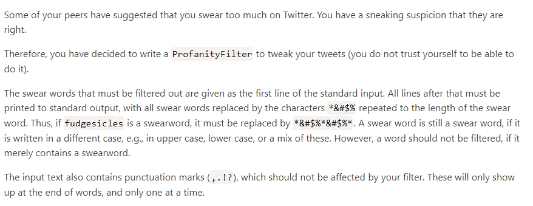
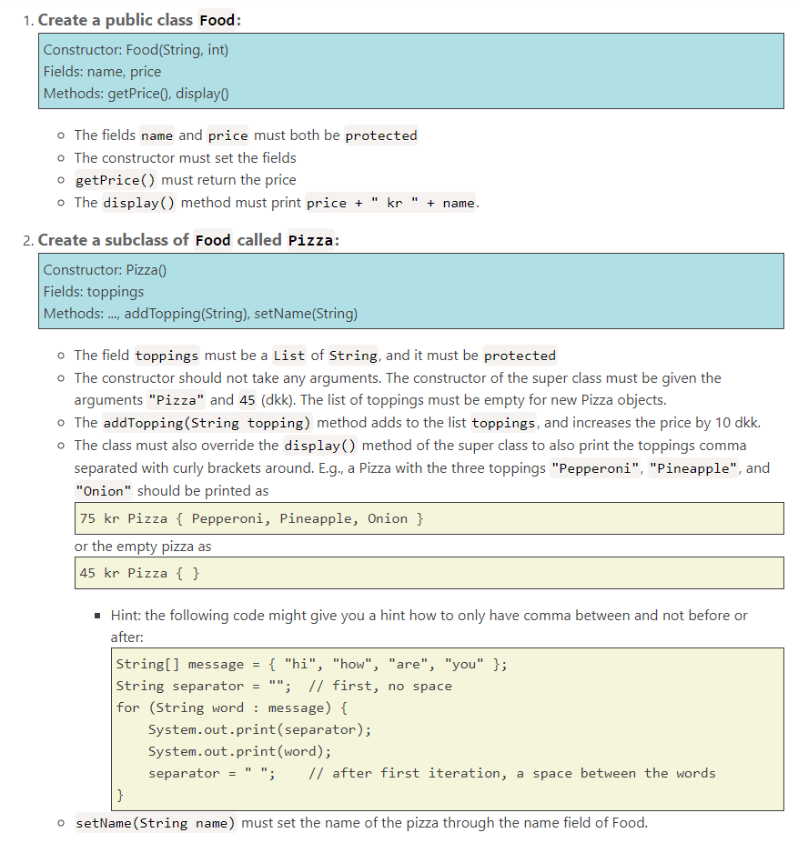
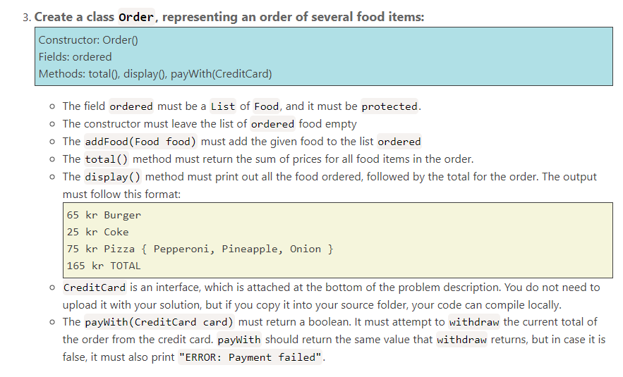
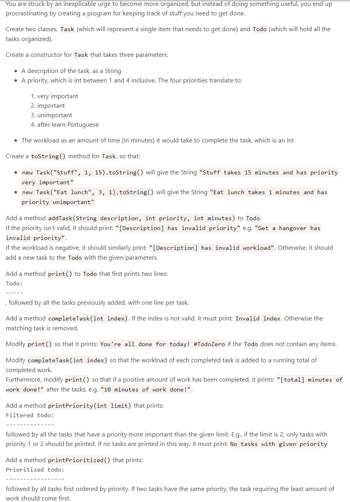

# ProgrammingAssignments
Mandatory assignments for Introductory Programming at ITU

# Assignment 2:

# Assignment 3:

# Assignment 4:

# Assignment 5:

# Assignment 6:

# Assignment 7:

# Assignment 8:

